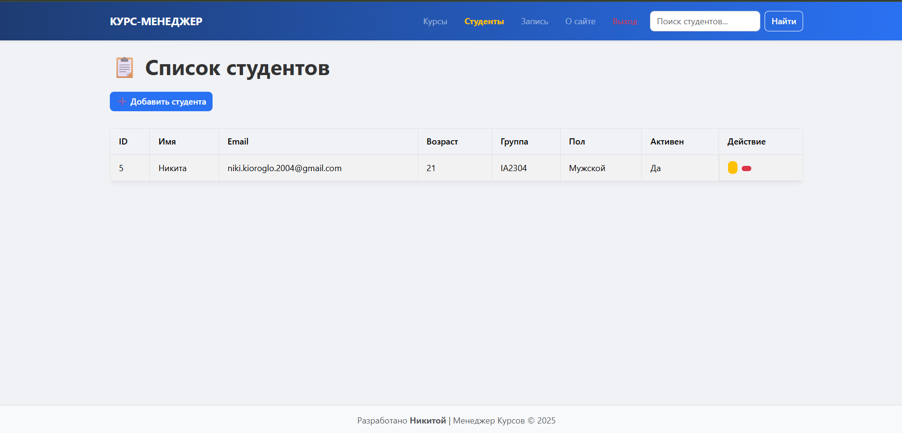
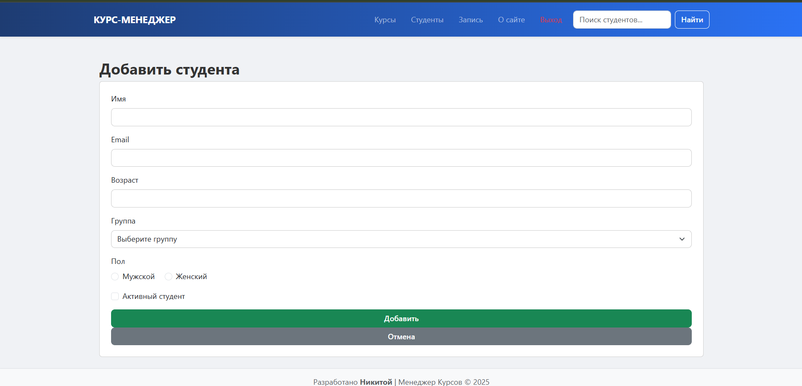
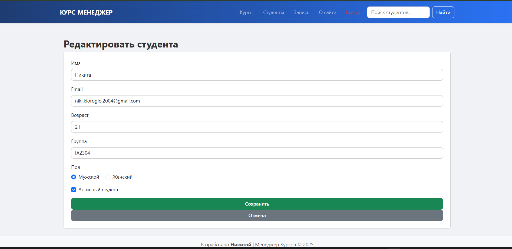
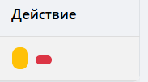
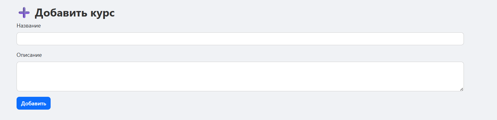
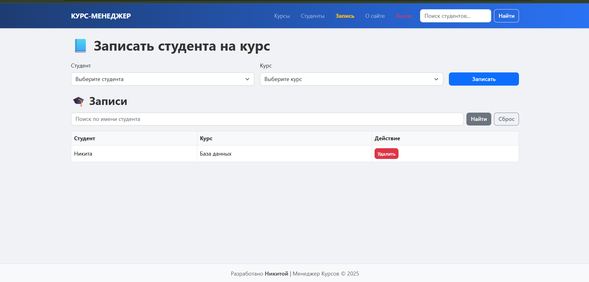

#  Course Manager — Индивидуальная работа

##  Инструкция по запуску проекта

1. Установите XAMPP или другой локальный сервер.
2. Скопируйте проект в директорию `htdocs`.
3. Запустите Apache и MySQL.
4. Импортируйте базы данных:

   * `education.sql` → база `education`
   * `logs.sql` → база `logs`
5. Откройте `http://localhost/course-manager/register.php`.

---

##  Описание

**Course Manager** — веб-приложение для управления курсами и студентами.

* Язык: PHP (без фреймворков)
* Базы данных: MySQL (`education`, `logs`)
* Интерфейс: Bootstrap 5
* Архитектура: модульная, с разделением на действия, шаблоны и страницы
* Реализована аутентификация и система ролей: **пользователь** и **администратор**

Вот улучшенная версия твоего README с добавлением информации о Bootstrap и аккуратным уточнением в соответствующем разделе:

---

## 📝 Описание

**Course Manager** — веб-приложение для управления курсами и студентами.

* **Язык:** PHP (без фреймворков)
* **Базы данных:** MySQL (`education`, `logs`)
* **Интерфейс:** Bootstrap 5 для адаптивного и современного дизайна форм, таблиц и кнопок
* **Архитектура:** модульная, с разделением на действия, шаблоны и страницы
* **Аутентификация:** через cookie-токен и система ролей (**пользователь**, **администратор**)

---

## 📌 Где используется Bootstrap

Весь интерфейс построен с использованием **Bootstrap 5**:

* Карточки (`<div class="card">`)
* Таблицы (`<table class="table table-bordered">`)
* Формы (`<form class="form-control">`)
* Кнопки (`<button class="btn btn-success">` и др.)
* Адаптивные сетки (`<div class="row">`, `<div class="col-md-6">`)

Пример в `register.php`:

```html
<link href="https://cdn.jsdelivr.net/npm/bootstrap@5.3.3/dist/css/bootstrap.min.css" rel="stylesheet">
```

---

##  Содержание

1. Функциональные возможности
2. Сценарии взаимодействия
3. Структура базы данных
4. Примеры использования кода
5. Ответы на контрольные вопросы
6. Источники
7. Дополнительно

---

##  1. Функциональные возможности

* Регистрация и вход в систему
* Публичная страница с курсами
* Администратор может:

  * Добавлять, редактировать, удалять студентов
  
  
  
  
  * Добавлять курсы
  
  * Просматривать журнал действий
  
* Пользователь может:

  * Только просматривать курсы и студентов

---

##  2. Сценарии взаимодействия

* **Гость** открывает `about.php` и видит курсы
* **Пользователь** регистрируется, входит и просматривает данные
* **Администратор** управляет студентами и курсами, смотрит логи

---

##  3. Структура базы данных

### `education`

```sql
CREATE TABLE courses (
  id INT AUTO_INCREMENT PRIMARY KEY,
  title VARCHAR(255),
  description TEXT
);

CREATE TABLE students (
  id INT AUTO_INCREMENT PRIMARY KEY,
  name VARCHAR(100),
  email VARCHAR(100),
  age INT,
  group_name VARCHAR(50),
  gender VARCHAR(10),
  active TINYINT(1)
);
```

### `logs`

```sql
CREATE TABLE users (
  id INT AUTO_INCREMENT PRIMARY KEY,
  login VARCHAR(100),
  password VARCHAR(255),
  role VARCHAR(10),
  token TEXT
);

CREATE TABLE actions_log (
  id INT AUTO_INCREMENT PRIMARY KEY,
  action TEXT,
  created_at TIMESTAMP DEFAULT CURRENT_TIMESTAMP
);
```

---

##  4. Примеры использования кода

###  Добавление студента

```php
if ($_SERVER['REQUEST_METHOD'] === 'POST') {
  $stmt = $eduPdo->prepare("INSERT INTO students (...) VALUES (?, ?, ?, ?, ?, ?)");
  $stmt->execute([$name, $email, $age, $group, $gender, $active]);
}
```

###  Проверка роли администратора

```php
function isAdmin() {
  return isset($GLOBALS['auth_user']['role']) && $GLOBALS['auth_user']['role'] === 'admin';
}
```

###  Проверка входа в систему

```php
function isLoggedIn() {
  return isset($GLOBALS['auth_user']);
}
```

###  Удаление студента

```php
if ($_SERVER['REQUEST_METHOD'] === 'POST' && isset($_POST['id'])) {
  $stmt = $eduPdo->prepare("DELETE FROM students WHERE id = ?");
  $stmt->execute([$_POST['id']]);
}
```

###  Редактирование студента

```php
$stmt = $eduPdo->prepare("
  UPDATE students
  SET name = ?, email = ?, age = ?, group_name = ?, gender = ?, active = ?
  WHERE id = ?
");
$stmt->execute([$name, $email, $age, $group, $gender, $active, $id]);
```

###  Логирование действий

```php
function logAction($message) {
  global $authPdo;
  $stmt = $authPdo->prepare("INSERT INTO actions_log (action) VALUES (?)");
  $stmt->execute([$message]);
}
```

###  Просмотр логов

```php
$logs = $authPdo->query("SELECT * FROM actions_log ORDER BY created_at DESC")->fetchAll();
```

###  Публичная страница (about.php)

```php
$courses = $eduPdo->query("SELECT * FROM courses ORDER BY id DESC")->fetchAll();
```

###  Проверка токена пользователя

```php
$token = $_COOKIE['auth_token'] ?? null;

$stmt = $authPdo->prepare("SELECT * FROM users WHERE token = ?");
$stmt->execute([$token]);
$user = $stmt->fetch();

if (!$user) {
  setcookie('auth_token', '', time() - 3600, '/');
  header('Location: /login.php');
  exit;
}
$GLOBALS['auth_user'] = $user;
```

---

##  5. Ответы на контрольные вопросы

* **Что такое PDO?**
  Это способ подключиться к базе данных в PHP и выполнять запросы безопасно.

* **Что делает `prepare()`?**
  Готовит SQL-запрос, защищая от SQL-инъекций.

* **Что такое `$_POST` и `isset()`?**
  `$_POST` — массив данных, отправленных из формы.
  `isset()` — проверяет, существует ли переменная.

* **Как определяется админ?**
  В базе у пользователя поле `role = 'admin'`.

* **Как хранится пароль?**
  С помощью `password_hash()`, затем проверяется через `password_verify()`.

---

##  6. Источники

* [PHP.net](https://www.php.net/)
* [MDN Web Docs](https://developer.mozilla.org/)
* [XAMPP](https://www.apachefriends.org/)

---

##  7. Дополнительно

* Проект не требует сторонних библиотек
* Лог действий записывается
* Используются две базы данных (`education`, `logs`)
* Код читаемый, документирован в стиле PHPDoc
* Приложение структурировано: actions / includes / templates / pages
