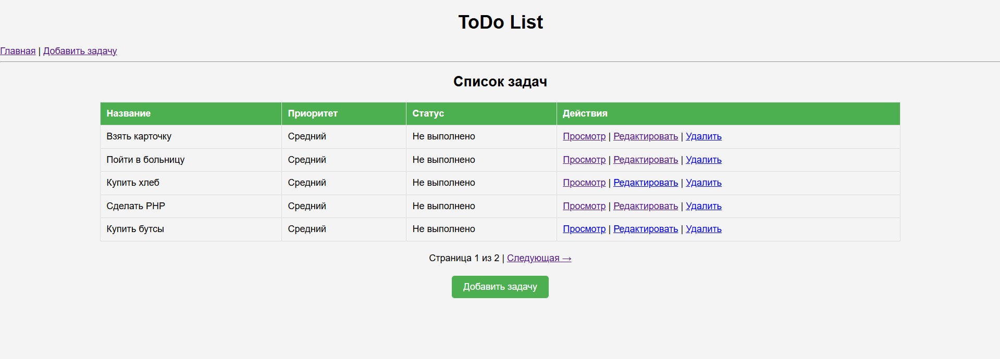
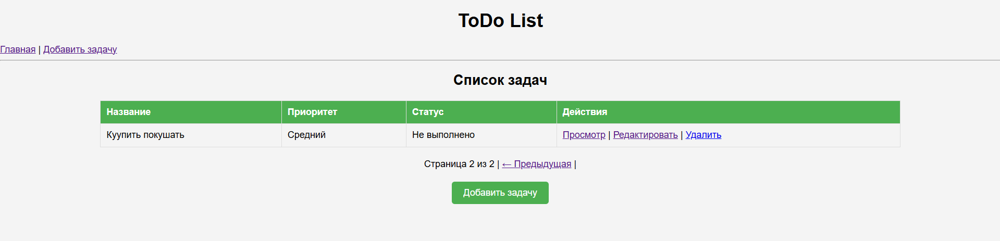
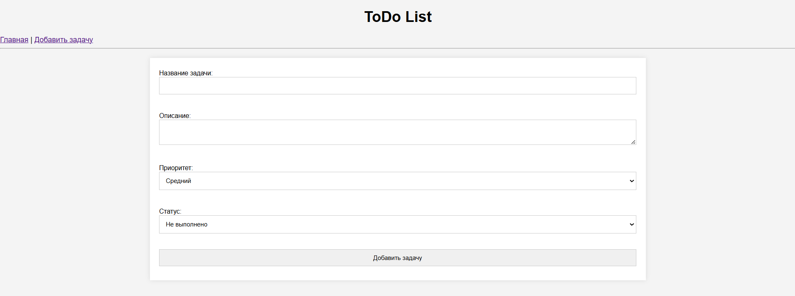
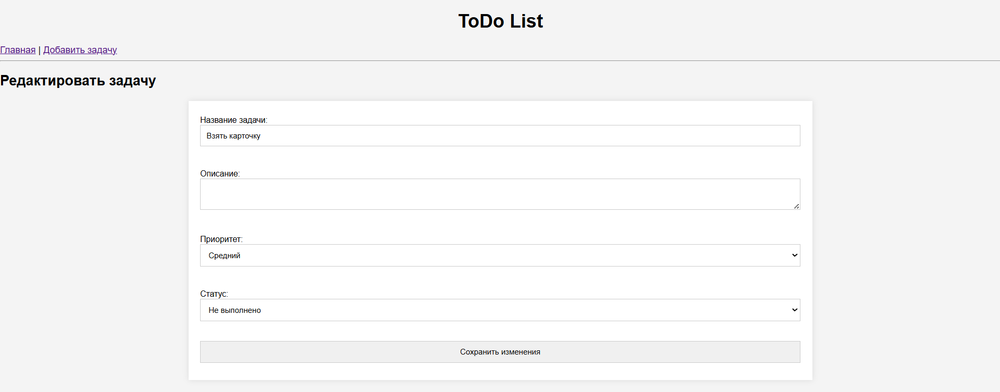
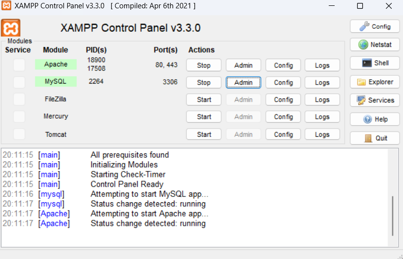

# Лабораторная работа №5: Работа с базой данных (ToDo-лист)

## Цель работы

- Освоить архитектуру с единой точкой входа (`index.php`)
- Подключить шаблоны для визуализации страниц (`layout.php`)
- Перенести хранение данных из файла в базу данных (MySQL)


## Инструкция по запуску

1. Установить XAMPP или любой другой сервер с поддержкой MySQL и PHP.
2. Разместить папку проекта в директории `htdocs` (например, `C:\xampp\htdocs\todo-list`).
3. Создать базу данных `todo_list` в phpMyAdmin.
4. Выполнить следующий SQL-запрос для создания таблицы `tasks`:

```sql
CREATE TABLE tasks (
  id INT AUTO_INCREMENT PRIMARY KEY,
  title VARCHAR(255) NOT NULL,
  description TEXT,
  priority VARCHAR(50) DEFAULT 'Средний',
  status VARCHAR(50) DEFAULT 'Не выполнено',
  created_at TIMESTAMP DEFAULT CURRENT_TIMESTAMP
);
Открыть браузер и перейти по адресу:
http://localhost/todo-list/public/
---

## Структура проекта

```jsx
todo-list/
├── public/
│   └── index.php
│   └── css/style.css
├── config/
│   └── db.php
├── src/
│   ├── db.php
│   └── handlers/
│       └── task/
│           ├── create.php
│           ├── edit.php
│           ├── delete.php
├── templates/
│   ├── layout.php
│   ├── index.php
│   └── task/
│       ├── create.php
│       ├── edit.php
│       └── show.php
└── README.md
```

## Основной функционал с примерами кода

### ✅ 1. Добавление новой задачи

**templates/task/create.php**
```php
<?php
/**
 * Шаблон страницы добавления новой задачи.
 *
 * Отображает HTML-форму для ввода данных новой задачи:
 * - название (обязательное поле)
 * - описание
 * - приоритет (низкий, средний, высокий)
 * - статус выполнения (не выполнено, в процессе, выполнено)
 *
 * При отправке формы данные передаются в обработчик create.php методом POST.
 *
 * @package ToDoList\Templates\Task
 */
?>

<form action="/todo-list/src/handlers/task/create.php" method="POST">
    <label>Название задачи:
        <input type="text" name="title" required>
    </label><br>

    <label>Описание:
        <textarea name="description"></textarea>
    </label><br>

    <label>Приоритет:
        <select name="priority">
            <option value="Низкий">Низкий</option>
            <option value="Средний" selected>Средний</option>
            <option value="Высокий">Высокий</option>
        </select>
    </label><br>

    <label>Статус:
        <select name="status">
            <option value="Не выполнено" selected>Не выполнено</option>
            <option value="В процессе">В процессе</option>
            <option value="Выполнено">Выполнено</option>
        </select>
    </label><br>

    <input type="submit" value="Добавить задачу">
</form>
```

**src/handlers/task/create.php**
```php
<?php
/**
 * Обработчик добавления новой задачи в базу данных.
 *
 * Выполняет:
 * - Получение данных из POST-запроса (название, описание, приоритет, статус)
 * - Валидацию обязательных полей
 * - Добавление новой записи в таблицу tasks
 * - Перенаправление пользователя обратно на список задач
 *
 * @package ToDoList\Handlers\Task
 */

require_once __DIR__ . '/../../db.php';

$pdo = getPDO();

// Получение данных из POST-запроса
$title = $_POST['title'] ?? '';
$description = $_POST['description'] ?? '';
$priority = $_POST['priority'] ?? 'Средний';
$status = $_POST['status'] ?? 'Не выполнено';

// Проверка обязательного поля "Название задачи"
if (trim($title) === '') {
    die('Название задачи обязательно.');
}

// Подготовка и выполнение SQL-запроса на добавление новой задачи
$stmt = $pdo->prepare("INSERT INTO tasks (title, description, priority, status) VALUES (?, ?, ?, ?)");
$stmt->execute([$title, $description, $priority, $status]);

// Перенаправление на главную страницу списка задач
header('Location: /todo-list/public/?page=index');
exit;
```

---

### ✅ 2. Просмотр подробной информации о задаче

**templates/task/show.php**
```php
$stmt = $pdo->prepare("SELECT * FROM tasks WHERE id = ?");
$stmt->execute([$id]);
$task = $stmt->fetch();

echo "<h2>" . htmlspecialchars($task['title']) . "</h2>";
echo "<p><strong>Описание:</strong> " . nl2br(htmlspecialchars($task['description'])) . "</p>";
echo "<p><strong>Приоритет:</strong> " . htmlspecialchars($task['priority']) . "</p>";
echo "<p><strong>Статус:</strong> " . htmlspecialchars($task['status']) . "</p>";
```

---

### ✅ 3. Редактирование задачи

**templates/task/edit.php**
```php
<?php
/**
 * Шаблон страницы редактирования задачи.
 *
 * Выполняет:
 * - Получение ID задачи из GET-запроса
 * - Загрузка данных задачи из базы данных
 * - Вывод формы с предзаполненными данными для редактирования
 * - Отправка изменений в обработчик edit.php методом POST
 *
 * @package ToDoList\Templates\Task
 */

$pdo = getPDO();

// Получение ID задачи из запроса
$id = $_GET['id'] ?? null;
if (!$id) {
    die("ID задачи не указан.");
}

// Загрузка задачи из базы данных
$stmt = $pdo->prepare("SELECT * FROM tasks WHERE id = ?");
$stmt->execute([$id]);
$task = $stmt->fetch();

if (!$task) {
    die("Задача не найдена.");
}
?>

<h2>Редактировать задачу</h2>

<form action="/todo-list/src/handlers/task/edit.php?id=<?= $task['id'] ?>" method="POST">
    <label>Название задачи:
        <input type="text" name="title" value="<?= htmlspecialchars($task['title']) ?>" required>
    </label><br>

    <label>Описание:
        <textarea name="description"><?= htmlspecialchars($task['description']) ?></textarea>
    </label><br>

    <label>Приоритет:
        <select name="priority">
            <option value="Низкий" <?= $task['priority'] === 'Низкий' ? 'selected' : '' ?>>Низкий</option>
            <option value="Средний" <?= $task['priority'] === 'Средний' ? 'selected' : '' ?>>Средний</option>
            <option value="Высокий" <?= $task['priority'] === 'Высокий' ? 'selected' : '' ?>>Высокий</option>
        </select>
    </label><br>

    <label>Статус:
        <select name="status">
            <option value="Не выполнено" <?= $task['status'] === 'Не выполнено' ? 'selected' : '' ?>>Не выполнено</option>
            <option value="В процессе" <?= $task['status'] === 'В процессе' ? 'selected' : '' ?>>В процессе</option>
            <option value="Выполнено" <?= $task['status'] === 'Выполнено' ? 'selected' : '' ?>>Выполнено</option>
        </select>
    </label><br>

    <input type="submit" value="Сохранить изменения">
</form>
```

**src/handlers/task/edit.php**
```php
$stmt = $pdo->prepare("UPDATE tasks SET title = ?, description = ?, priority = ?, status = ? WHERE id = ?");
$stmt->execute([$title, $description, $priority, $status, $id]);
```

---

### ✅ 4. Удаление задачи

**src/handlers/task/delete.php**
```php
$stmt = $pdo->prepare("DELETE FROM tasks WHERE id = ?");
$stmt->execute([$id]);
```

---

### ✅ 5. Пагинация (по 5 задач)

**templates/index.php**
```php
$page = max(1, (int)($_GET['p'] ?? 1));
$perPage = 5;
$offset = ($page - 1) * $perPage;

$total = $pdo->query("SELECT COUNT(*) FROM tasks")->fetchColumn();
$pages = ceil($total / $perPage);

$tasks = $pdo->query("SELECT * FROM tasks ORDER BY created_at DESC LIMIT $perPage OFFSET $offset")->fetchAll();
```

```php
<div style="text-align:center;">
    Страница <?= $page ?> из <?= $pages ?> |
    <?php if ($page > 1): ?>
        <a href="?page=index&p=<?= $page - 1 ?>">← Предыдущая</a> |
    <?php endif; ?>
    <?php if ($page < $pages): ?>
        <a href="?page=index&p=<?= $page + 1 ?>">Следующая →</a>
    <?php endif; ?>
</div>
```

---

### ✅ 6. Валидация данных

**create.php / edit.php**
```php
if (trim($title) === '') {
    die('Название задачи обязательно.');
}
```

---

### ✅ 7. Защита от SQL-инъекций

Все запросы используют подготовленные выражения:
```php
$stmt = $pdo->prepare("SELECT * FROM tasks WHERE id = ?");
$stmt->execute([$id]);
```

**SQL-инъекция пример** (опасно!):
```sql
?id=1 OR 1=1
```

**Предотвращение:**
- используем `prepare()`
- параметры передаются отдельно (`execute([$id])`)

---

## Подключение к базе данных

**config/db.php**
```php
return [
    'host' => '127.0.0.1',
    'dbname' => 'todo_list',
    'user' => 'root',
    'password' => ''
];
```

**src/db.php**
```php
function getPDO() {
    $config = require __DIR__ . '/../config/db.php';
    $dsn = "mysql:host={$config['host']};dbname={$config['dbname']};charset=utf8mb4";
    return new PDO($dsn, $config['user'], $config['password'], [
        PDO::ATTR_ERRMODE => PDO::ERRMODE_EXCEPTION,
        PDO::ATTR_DEFAULT_FETCH_MODE => PDO::FETCH_ASSOC,
    ]);
}
```

---

## Ответы на контрольные вопросы

###  **1. Какие преимущества даёт использование единой точки входа в веб-приложении?##
**Единая точка входа** (например, `index.php`) — это центральный файл, который обрабатывает все HTTP-запросы.

**Преимущества:**
-  **Безопасность:** можно централизованно фильтровать ввод, проверять авторизацию и защищаться от атак.
-  **Удобная маршрутизация:** проще управлять переходами между страницами (например, через `?page=create`).
-  **Масштабируемость:** легче добавлять новые страницы без изменения структуры проекта.


###  **2. Какие преимущества даёт использование шаблонов?**

**Шаблон** (например, `layout.php`) — это базовая структура HTML, в которую вставляется содержимое (`$content`).

**Преимущества:**
-  **Повторное использование кода:** один шаблон для всех страниц (шапка, подвал и т.д.).
-  **Отделение логики от представления:** бизнес-логика в PHP, интерфейс — в HTML-шаблоне.

###  **3. Какие преимущества даёт хранение данных в базе по сравнению с файлами?**

**Сравнение:**

| Файлы (JSON/CSV) | База данных (MySQL) |
|------------------|----------------------|
| Простая реализация | Надёжное хранилище |
| Плохо масштабируется | Масштабируется под большие объёмы |
| Нет индексов и связей | Быстрые запросы и связи (JOIN) |
| Сложно фильтровать и сортировать | SQL-запросы позволяют гибко работать с данными |

**Вывод:** база данных — предпочтительный способ хранения для динамических веб-приложений.


###  **4. Что такое SQL-инъекция? Придумайте пример SQL-инъекции и объясните, как её предотвратить.**

**SQL-инъекция** — это уязвимость, при которой злоумышленник внедряет SQL-код в пользовательский ввод, чтобы изменить запрос.

**Пример (опасный код):**
```php
$id = $_GET['id'];
$result = $pdo->query("SELECT * FROM tasks WHERE id = $id");
```

Если пользователь введёт: `id=1 OR 1=1`, SQL станет:
```sql
SELECT * FROM tasks WHERE id = 1 OR 1=1
```

**Результат:** будут возвращены все задачи — утечка данных.

**Как предотвратить:**
 Использовать **подготовленные выражения (Prepared Statements)**:
```php
$stmt = $pdo->prepare("SELECT * FROM tasks WHERE id = ?");
$stmt->execute([$id]);
```
Проверять и **валидировать** пользовательский ввод.

---

## Скриншоты

 Добавление, просмотр, редактирование задач, пагинация и стили были реализованы в полном соответствии с заданием.





